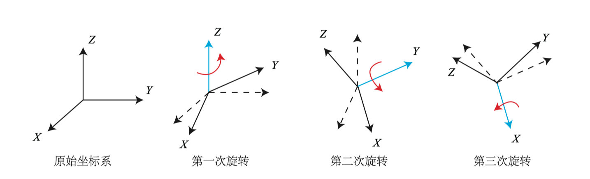

# 三维空间的刚体运动

[TOC]

## 点与坐标轴

点乘（内积, inner product）

$$
a=[a_1, a_2, \dots, a_n], b = [b_1, b_2, \dots, b_n] \\
a \cdot b = a_1 b_1 + a_2 b_2 + \dots + a_n b_n \\
a \cdot b = a^T b = \sum_{i=1}^{3}a_ib_i=\left|a\right|\left|b\right|cos\left<a, b\right>
$$

计算两个向量间的夹角，以及 $b$ 向量在 $a$ 向量方向上的投影。

$$
a \cdot b = \left|a\right|\left|b\right| cos \theta
$$

叉乘（外积, cross/vector product）
$$
a=(x_1, y_1, z_1)\ \ b=(x_2, y_2, z_2) \\
a\times b = 
\left|\begin{array}{cccc} 
    i   &  j    & k \\ 
    x_1 &  y_1  & z_1\\ 
    x_2 &  y_2  & z_2 
\end{array}\right| 
=(y_1z_2-y_2z_1)i-(x_1z_2-x_2z_1)j+(x_1y_2-x_2y_1)k \\

i = (1, 0, 0)\  \
j = (0, 1, 0)\  \
k = (0, 0, 1)\\

a\times b =(y_1z_2-y_2z_1, -(x_1z_2-x_2z_1), x_1y_2-x_2y_1)
$$

NOTE: $a^{\wedge}$ 为反对称矩阵 (skew-symmetric)，将外积 $a \times b$ 写成了矩阵和向量的乘法 $a^{\wedge}b$. 

$$
a \times b = 
{
    \left[ 
        \begin{array}{ccc}
            i & j & k \\
            a_1 & a_2 & a_3 \\
            b_1 & b_2 & b_3 
        \end{array}
    \right ]
}
= 
{
    \left[ 
        \begin{array}{ccc}
            a_2b_3-a_3b_2 \\
            a_3b_1-a_1b_3 \\
            a_1b_2-a_2b_1 
        \end{array}
    \right ]
}
= 
{
    \left[ 
        \begin{array}{ccc}
            0 & -a_3 & a_2 \\
            a_3 & 0 & -a_1 \\
            -a_2 & a_1 & 0 
        \end{array}
    \right ]
}b
\triangleq
a^{\wedge}b
$$

外积点方向垂直于这两个向量，大小为 $\left|a\right|\left|b\right|sin\left<a,b\right> $， 是两个向量张成的四边形的有向面积。

在二维空间中，叉乘的几何意义为由向量 $a$ 和向量 $b$ 构成的平行四边形的面积。

## 旋转矩阵

单位正交基 $(e_1, e_2, e_3)$ 经过一次旋转变成了 $(e_1^{’}, e_2^{’}, e_3^{’})$，向量 $a$ 不动时：
$$
[e_1, e_2, e_3] 
{
    \left[ 
        \begin{array}{c}
            a_1 \\
            a_2 \\
            a_3 
        \end{array}
    \right ]
} 
=
[e_1^{’}, e_2^{’}, e_3^{’}]
{
    \left[ 
        \begin{array}{c}
            a_1^{'} \\
            a_2^{'} \\
            a_3^{'} 
        \end{array}
    \right ]
}
$$
对上述等式的左右两边同时左乘 ${
    \left[ 
        \begin{array}{c}
            e_1^{T} \\
            e_2^{T} \\
            e_3^{T} 
        \end{array}
    \right ]
} $， 左边的系数就变成了单位矩阵：
$$
a = {
    \left[ 
        \begin{array}{c}
            a_1 \\
            a_2 \\
            a_3 
        \end{array}
    \right ]
} 
=
{
    \left[ 
        \begin{array}{ccc}
            e_1^{T}e_1^{’} & e_1^{T}e_1^{’} & e_1^{T}e_1^{’}  \\
            e_1^{T}e_1^{’} & e_1^{T}e_1^{’} & e_1^{T}e_1^{’} \\
            e_1^{T}e_1^{’} & e_1^{T}e_1^{’} & e_1^{T}e_1^{’}
        \end{array}
    \right ]
}
{
    \left[ 
        \begin{array}{c}
            a_1^{'} \\
            a_2^{'} \\
            a_3^{'} 
        \end{array}
    \right ]
}
\triangleq
Ra'
$$
$R$ 为旋转矩阵，为正交矩阵 ($R^{-1}=R^T, R^T\cdot R=I$).   R 的行列式：
$$
det(R^T R)= det(R^T)det(R)=det(R)^2=1 \\
$$
$det(R) = 1$ 时 $R$ 为正常旋转, $det(R) = -1$ 时 $R$ 为反射+旋转.

旋转集合的定义（特殊正交群，$n$ 维空间的旋转矩阵教程）：
$$
SO(n) = \{R\in \mathbb{R}^{n\times n}=I, det(R)=1\}
$$
相反的旋转：
$$
a' = R^{-1}a = R^{T}a
$$
相互变换：

- $a_1 = R_{12}a_2$, from 2 to 1.
- $a_2 = R_{21}a_1$, from 1 to 2.
- $R_{21}=R_{12}^{-1}=R_{12}^T$.

$$
\begin{align}
a' &= Ra + t \\
b = R_1a+t_1, c& =R_2b+t_2  \Longrightarrow c = R_2(R_1a+t_1)+t_2
\end{align}
$$
齐次形式 (Homogeneous)：
$$
{
    \left[ 
        \begin{array}{c}
            a' \\
            1
        \end{array}
    \right ]
} 
=
{
    \left[ 
        \begin{array}{c}
            R & t \\
            0^T & 1 \\
        \end{array}
    \right ]
}
{
    \left[ 
        \begin{array}{c}
            a \\
            1
        \end{array}
    \right ]
}
\triangleq
T
{
    \left[ 
        \begin{array}{c}
            a \\
            1
        \end{array}
    \right ]
}
$$
变换矩阵：
$$
\widetilde b = T_1 \widetilde a, \widetilde c = T_2 \widetilde b \Longrightarrow
T_2T_1 \widetilde a.
$$

$$
\widetilde a = {
    \left[ 
        \begin{array}{c}
            a \\
            1 \\
        \end{array}
    \right ]
} =
k{
    \left[ 
        \begin{array}{c}
            a \\
            1 \\
        \end{array}
    \right ]
} 

\\
\widetilde x = [x,y,z,w]^T = [x/w, y/w, z/w, 1]^T
$$

特殊欧式群 $SE(3)$:
$$
SE(3)=\left\{ T = \left[ 
        \begin{array}{c}
            R & t \\
            0^T & 1 \\
        \end{array}
    \right ] \in \mathbb R^{4\times 4} | R \in SO(3), t\in \mathbb R^{3} \right\} \\
    T^{-1} = \left[ 
        \begin{array}{c}
            R^T & -R^Tt \\
            0^T & 1 \\
        \end{array}
    \right ]
$$

## 旋转向量

罗德里格斯公式 (Rodrigues’s Formula):
$$
R = cos \theta I+ (1-cos\theta)\ nn^T + sin \theta\ n^{\wedge}
$$

$$
\begin{equation}
\begin{split}
tr(R) &= cos\theta tr(I) + (1-cos\theta)\ tr(nn^T)+sin\theta\ tr(n^{\wedge}) \\
&= 3cos\theta + (1-cos\theta) \\
&= 1+2cos\theta \\
& \Longrightarrow \\

\theta &= arccos(\frac{tr(R)-1}{2})

\end{split}
\end{equation}
$$

Also, $Rn=n$.

## 欧拉角

ZYX , yaw （偏航角）, pitch（俯仰角）, roll（滚转角）:

## 四元数

2D 情况下，可以用单位复数表达旋转： $z=x+iy=\rho e^{i\theta}$. 乘 $i$ 即转 90 度，乘 $-i$ 即转 -90 度。

3D 下，四元数可以作为复数的扩充 (Quaternion):
$$
q=q_0+q_1i+q_2j+q_3k \\
i^2 = j^2 = k^2 = -1 \\
ij = k, ji = -k \\
jk = i, kj = -i \\
ki = j, ik = -j
$$

$$
q=[s,\textbf{v}], s = q_0 \in \mathbb R, \textbf{v} =[q_1, q_2, q_3]^T \in \mathbb R^3
$$

角轴到四元数：
$$
q = \left[ cos\frac{\theta}{2}, n_xsin\frac{\theta}{2}, n_ysin\frac{\theta}{2}, n_zsin\frac{\theta}{2}\right]^T
$$
四元数到角轴：
$$
\left\{  
\begin{array}{**lr**}  
\theta = 2arccos q_0\\  
[n_x, n_y, n_z]^T = [q_1, q_2, q_3]^T / sin \frac{\theta}{2}
\end{array}  
\right.
$$

用四元数表示旋转：
$$
p = [0, x, y, z] = [0, \textbf{v}] \\
q = [cos\frac{\theta}{2}, n\sin\frac{\theta}{2}] \\
p' = qpq^{-1}
$$

## 相似、仿射、射影变换

|                变换名称                |                           矩阵形式                           | 自由度 |
| :------------------------------------: | :----------------------------------------------------------: | :----: |
|                欧式变换                | $\left[         \begin{array}{c}            R & t \\            0^T & 1 \        \end{array}    \right ]$ |   6    |
|                相似变换                | $\left[         \begin{array}{c}            sR & t \\            0^T & 1 \        \end{array}    \right ]$ |   7    |
| 仿射变换 （A可逆矩阵，不必是正交矩阵） | $\left[         \begin{array}{c}            A & t \\            0^T & 1 \        \end{array}    \right ]$ |   12   |
|          射影变换（近大远小）          | $\left[ \begin{array}{c}         A & t \\          a^T & v \\  \end{array}  \right ]$ |   15   |

