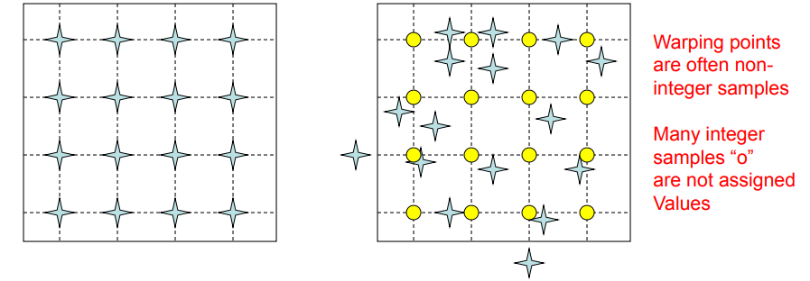
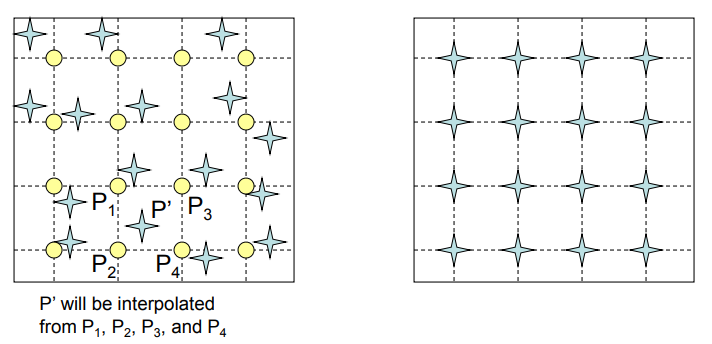
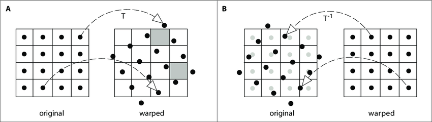

# Image Wapring: Forward and inverse

[TOC]

## Wapring

Warp source image $f(u,v)$ to target image $g(x,y)$.

### Forward Warping

Left: source, right: target. Distribute color among neighboring pixels if pixel lands between two pixels. 

### Inverse Warping

### Interpolation Method

Several methods are taken to conduct interpolation for resampling color pixels in inverse warping: 

- Nearest neighbor: Round $(u,v)$ to the nearest integer coordinate.

- Bbicubic.

- Sinc.

- Trilinear interpolation: used in 3-d regular grid.

- Linear interpolation: 
  $$
  \begin{equation}
      \begin{aligned}
          \frac{y-y_0}{x-x_0} &= \frac{y_1-y_0}{x_1-x_0} \\
          y = \frac{x_1-x}{x_1-x_0}y_0 &+ \frac{x-x_0}{x_1-x_0}y_1
      \end{aligned}
  \end{equation}
  $$

- Bilinear interpolation: find four integer samples nearest to $(u,v)$, then apply bilinear interpolation:
  $$
  \begin{equation}
      \begin{aligned}
  f(x,y) \thickapprox \frac{f(x_1, y_1)}{(x_2 - x_1)(y_2 - y_1)}(x_2 - x)(y_2 - y) &+ \frac{f(x_2, y_1)}{(x_2 - x_1)(y_2 - y_1)}(x - x_1)(y_2 - y) + \\
  \frac{f(x_1, y_2)}{(x_2 - x_1)(y_2 - y_1)}(x_2 - x)(y - y_1) &+ \frac{f(x_2, y_2)}{(x_2 - x_1)(y_2 - y_1)}(x - x_1)(y - y_1)
      \end{aligned}
  \end{equation}
  $$
  

